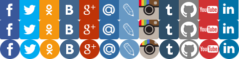

# Социальные аккаунты

Кнопки-ссылки на группы и аккаунты в социальных сетях. Можно подключать свои стили.

**Скриншоты в конце описания**

* Смена стиля кнопок (предустановлены 4 стиля)
* Вконтакте
* Facebook
* YouTube
* Twitter
* Google+
* Одноклассники
* Instagram
* Мой мир@Mail.ru
* Живой Журнал
* tumblr
* Github
* Linkedln

Требуемые модули от SL7:
* [sl7_control_panel](https://github.com/SemyonDragunov/sl7_control_panel)

Для Drupal 7. PHP =< 5.4

Автор: Семён Драгунов [sam.dragunov@gmail.com](sam.dragunov@gmail.com)

Apache License 2.0

Если необходима английская версия модуля, пишите автору.

***
# Social button (accounts)

Button-links to groups and accounts on social networks.

**Screenshots at the end of the this description**

* Change the style of the buttons (preset 4 styles)
* In contact with
* Facebook
* YouTube
* Twitter
* Google+
* Classmates
* Instagram
* Мой мир@Mail.ru
* Livejournal
* tumblr
* Github
* Linkedln

Required modules from SL7:
* [sl7_control_panel](https://github.com/SemyonDragunov/sl7_control_panel)

For Drupal 7. PHP =< 5.4

Author: Semyon Dragunov [sam.dragunov@gmail.com](sam.dragunov@gmail.com)

Apache License 2.0

If you need an English version of the module, write to author.

***

